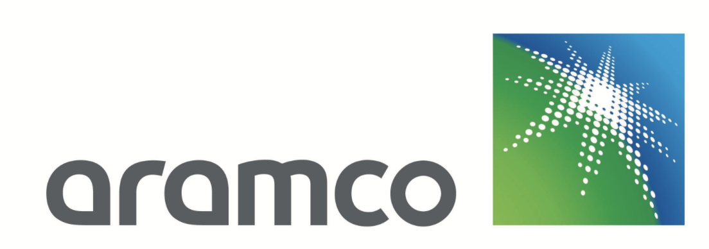

# Aramco Watsonx Bootcamp - KSA (20-21 May 2024)
## Agenda

| **Time**        | **Topic**                                                                                                                             |
|-----------------|---------------------------------------------------------------------------------------------------------------------------------------|
| 30 mins  | Lab 0: [Setup Your Laptop Environment](./self-guided-labs/lab-0-laptop-environment-setup)                                     |  
| 60 mins  | Lab 1: [Prompt engineering using Prompt Builder & Advanced Prompt Engineering Techniques](./self-guided-labs/lab-01-Prompt-Engineering-Using-Prompt-Builder&Advanced-Prompt-Engineering-Techniques)                                     |                       |  
| 30 mins  | Lab 2: [Prompt Tuning for Classification](./self-guided-labs/lab-02-Prompt-Tuning-for-Classification) |                 | 
| 45 mins  | Lab 3: [watsonx.ai and Langchain Capabilities](./self-guided-labs/lab-03-watsonxai-and-Langchain-Capabilities)                                     |  
| 20 mins  | Lab 4: [Retraivel Augmented Generation (RAG) using watsonx.ai](./self-guided-labs/lab-04-Retrieval-Augmented-Generation-RAG-usecase-using-watsonxai)      |  
| 25 mins  | Lab 5: [Introduction to RAG with Discovery](./self-guided-labs/lab-05-Introduction-to-RAG-with-Discovery)             |
| 30 mins  | Lab 6: [Text Classification Using watsonai](./self-guided-labs/lab-06-Text-Classification-Using-watsonai)             |
| 30 mins  | Lab 7: [Code Generation Capabilities using watosnx.ai](./self-guided-labs/lab-07-Code-Generation-Capabilities-watsonxai)             |

