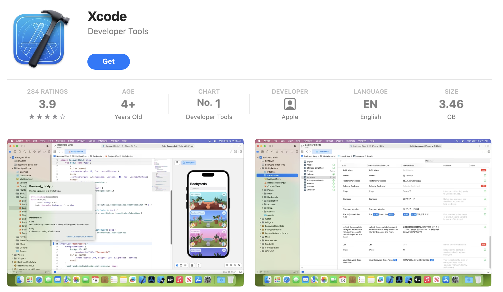
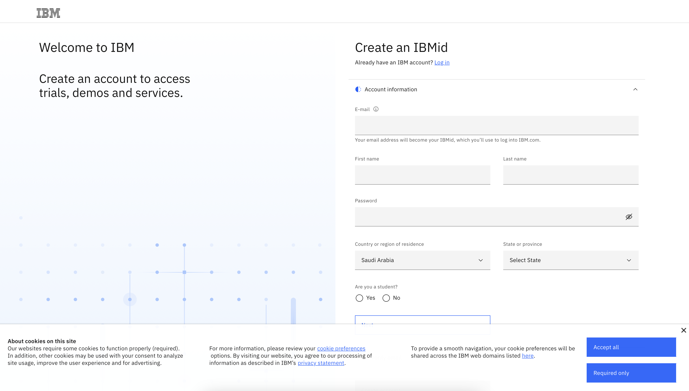
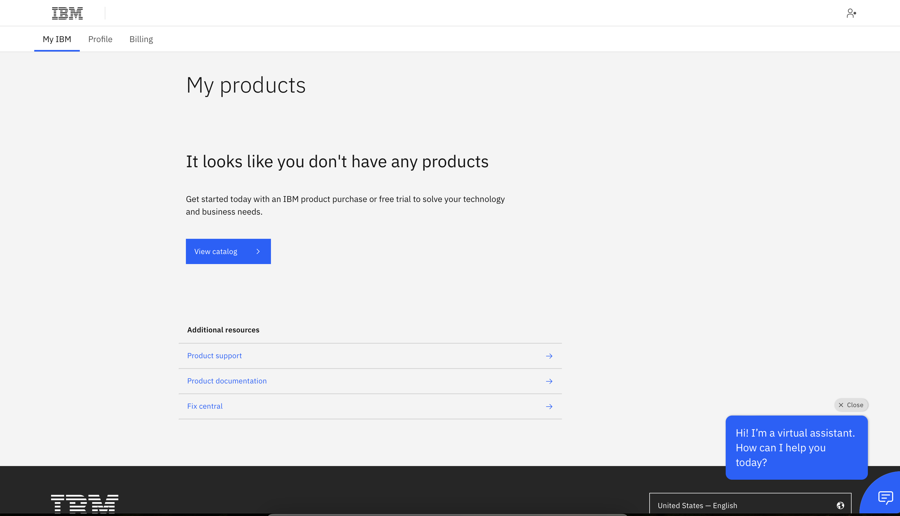
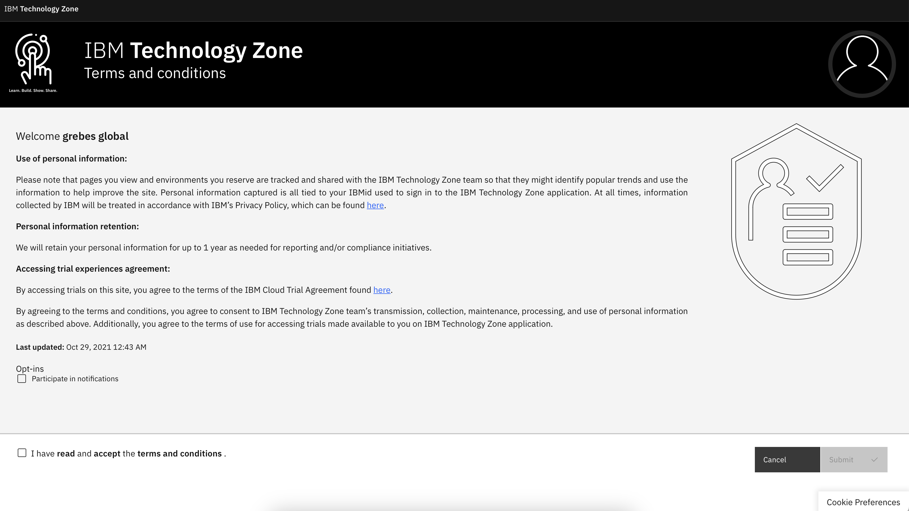
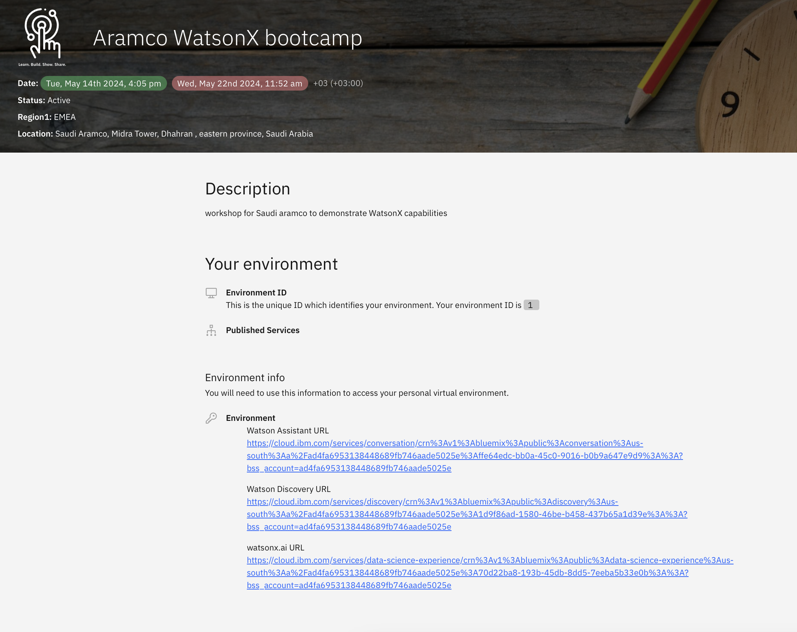
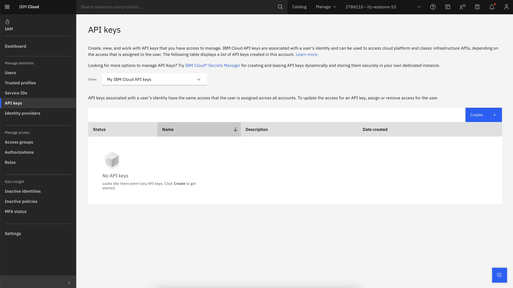
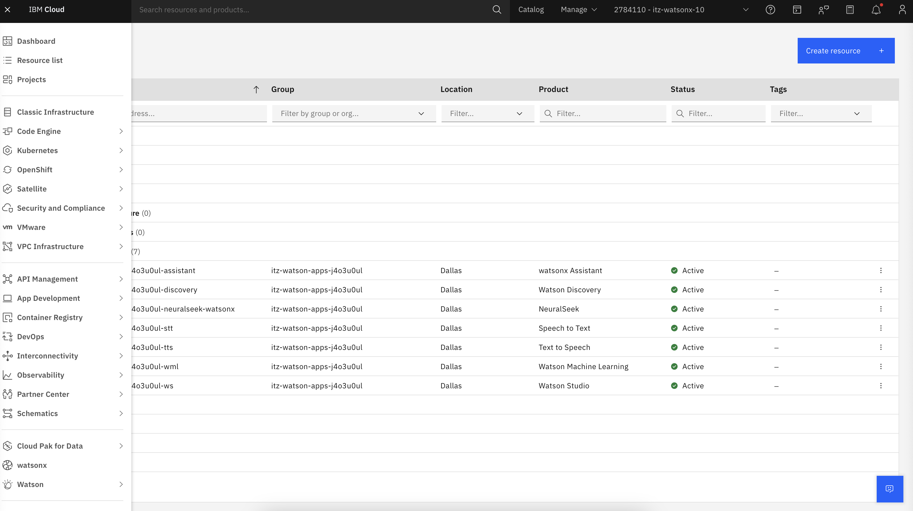
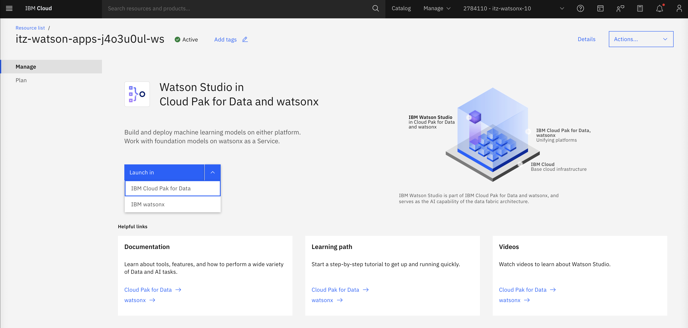
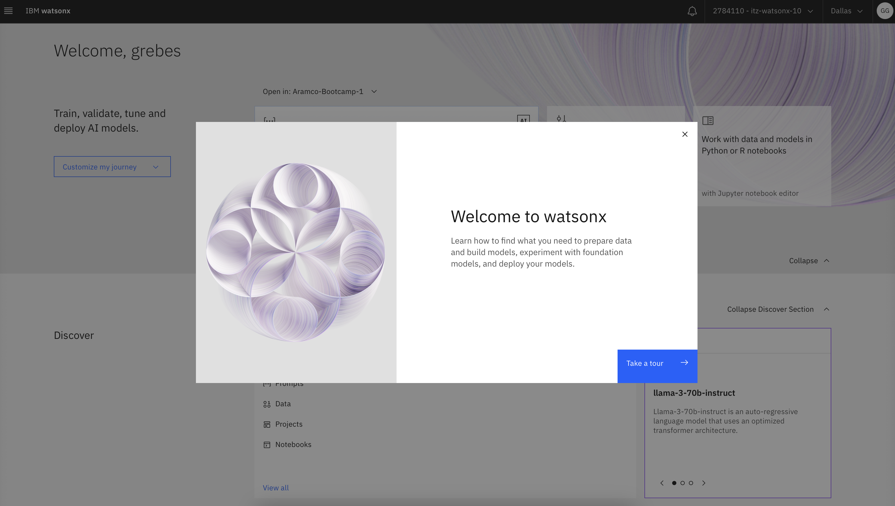

# Environment Setup

## Introduction
To maximise your learning experience and ensure the workshop runs smoothly, it is crucial to prepare your environment in advance. This guide provides detailed steps to install all the necessary tools and libraries. Please complete these prerequisites diligently before the workshop begins. **Your adherence to these preparation steps is essential for your success in the workshop.**


## Steps to complete
- [Environment Setup](#environment-setup)
  - [Introduction](#introduction)
  - [Steps to complete](#steps-to-complete)
    - [0: (For Mac Users Only) Install/Update Xcode](#0-for-mac-users-only-installupdate-xcode)
    - [1: Create an IBMid](#1-create-an-ibmid)
      - [1a: Create an IBMid](#1a-create-an-ibmid)
      - [1b: Access your workshop environment via the Attendee URL](#1b-access-your-workshop-environment-via-the-attendee-url)
      - [1c: Accept the invitation to join the IBM Cloud account](#1c-accept-the-invitation-to-join-the-ibm-cloud-account)
    - [2: Obtain your IBM Cloud API key](#2-obtain-your-ibm-cloud-api-key)
    - [3: Clone the Workshop's Github repo](#3-clone-the-workshops-github-repo)
    - [4: Create Virtual Python Environment and Install Jupyter and Required Libraries](#4-create-virtual-python-environment-and-install-jupyter-and-required-libraries)
    - [5: Choose your Jupyter Notebook Runtime](#5-choose-your-jupyter-notebook-runtime)
      - [6a: Run Jupyter Server and Validate All Libraries Installed](#6a-run-jupyter-server-and-validate-all-libraries-installed)
      - [6b: Install Visual Studio Code (VS Code)](#6b-install-visual-studio-code-vs-code)
    - [7: Validate All Libraries Installed](#7-validate-all-libraries-installed)
    - [8: Security and .env Files](#8-security-and-env-files)
    - [9: .gitignore Files](#9-gitignore-files)

### 0: (For Mac Users Only) Install/Update Xcode <a id="0-for-mac-users-only-installupdate-xcode"></a>
Setting up your environment via the steps below can reveal various distinct problems, several of which will be the result of not having your Mac properly setup for development. Xcode is a collection of developer tools that enable building applications for Apple's various operating systems (MacOS, iOS, etc) but also comes with some command line tools and a C compiler. The latter is necessary to install some of the dependencies required for this workshop.

❗Updating Xcode takes several hours! Do this first, and go make some coffee...

Launch the App Store and search for "Xcode." Click the "Get" button or the Cloud icon to install the latest version.



### 1a: Create an IBMid <a id="1a-create-an-ibmid"></a>
To access the workshop environments, you must first register for an IBMid account. Completing this step is essential to gain access to the workshop's pages and environments.

- Go to the [IBMid registeration page](https://www.ibm.com/account/reg/us-en/signup?formid=urx-19776) and create an account.
- Complete the account information fields with your details.
- You will receive a new user registeration email, use the code therein to activate your IBMid.
- If successful, you will receive a registeration successful email.
- You may also receive an email from IBM Security to verify your account, enter the verificaton code to proceed.



- After completing the above steps you will see the landing page for myIBM, logged in with your new IBMid.



### 1b: Access your workshop environment via the Attendee URL <a id="1b-access-your-workshop-environment-via-the-attendee-url"></a>
Navigate to the [Attendee URL](https://techzone.ibm.com/my/workshops/student/6640bf13953c6b001ec9c2cb) (if prompted to login, use your newly created IBMid).



- Read and aree to the terms and conditions
- There will be a `Welcome to IBM Technology Zone!` - you can click skip for now.
- Enter the workshop password/access code: `ibmaramco2024`

Once logged in you will see the service URLs to access the environment!



Now a unique ID has been assigned to you which identifies your environment. 

### 1c: Accept the invitation to join the IBM Cloud account <a id="1c-accept-the-invitation-to-join-the-ibm-cloud-account"></a>
After completing the above steps, you will be sent an invitation to join the IBM Cloud account associated with your unique environment. This will take approx. 10-15 mins to arrive so be patient!

❗ Click `Join now` to accept the invite. You will be asked to log into IBM Cloud (use the IBMid credentials created earlier).

**That's it! Congratuations, you've successfully set up an IBM Cloud account!**

### 2: Obtain your IBM Cloud API key <a id="2-obtain-your-ibm-cloud-api-key"></a>
You will need your IBM Cloud API key to authenticate the Watson Machine Learning Python SDK client and interact with watsonx.ai foundation models. Follow [these instructions](https://cloud.ibm.com/docs/account?topic=account-userapikey&interface=ui#create_user_key) to generate a new one in the [IBM Cloud Console](https://cloud.ibm.com). You will need this API key for [Step 8](#environment-files).



#### Initialise watsonx.ai
- Navigate to the burger menu on the left, open the panel and click `Resource list`.
- Expand the group `AI/Machine Learning` and select the Watson Studio instance



- Launch Watson Studio in IBM watsonx.
- Let it initialise and then exit.




### 3: Clone the workshop's Github repo <a id="3-clone-the-workshops-github-repo"></a>
If you're a Github pro then you can directly clone this wastonx.ai workshop repo. Otherwise we recommend downloading and installing the [Github Desktop](https://desktop.github.com/) and then cloning this watsonx.ai workshop repo. Here are instructions on [how to clone a repository using Github Desktop](https://docs.github.com/en/desktop/contributing-and-collaborating-using-github-desktop/adding-and-cloning-repositories/cloning-a-repository-from-github-to-github-desktop).

### 4: Create Virtual Python Environment and Install Jupyter and Required Libraries <a id="4-create-virtual-python-environment-and-install-jupyter-and-required-libraries"></a>
Python applications import multiple libraries, and oftentimes, conflicts can occur between different versions of required libraries. However, your app may require a specific library version due to a bug fix. The solution is to create a virtual environment, a self-contained suite of libraries for a specific Python installation.

To ensure all required Python libraries are installed, [complete these steps to create your virtual Python environment.](create-virtual-python-environment.md)

**NOTE:** Don't skip setting up your Python environment as the documented steps ensure you have installed the Watson Machine Learning Python SDK, Jupyter Notebook, ChromaDB, Hugging Face and all other required libraries.

### 5: Choose your Jupyter Notebook Runtime <a id="5-choose-your-jupyter-notebook-runtime"></a>
In order to use Jupyter notebooks, there are a few choices.

A Jupyter server can be installed and run locally very easily. Jupyter notebooks can also be run in VS Code using a plugin. It's up to you which you prefer. If in doubt, VS Code is a simple solution with which many data scientists are familiar.

#### 6a: Run Jupyter Server and Validate All Libraries Installed <a id="6a-run-jupyter-server-and-validate-all-libraries-installed"></a>
You will be executing several Jupyter notebooks during this workshop. The Jupyter Notebook executable was installed as part of your Virtual Environment setup in [Step #6](create-virtual-python-environment.md).

Before executing the command below, choose the root directory for the server. When the server starts, your current working directory will become the server's root directory. In its user interface, you won't be able to access files above that directory. If you would like to focus only on these labs, choose the root of the repo directory. Otherwise, you could choose something higher like the directory in which you store all of your repos or your Documents folder, for instance.

```
# ensure your python virtual environment is active
cd <directory chosen as server's root directory>
jupyter notebook
```

Jupyter should automatically open a browser window for you. If not, navigate to http://localhost:8888/notebooks/ to run the notebook.

#### 6b: Install Visual Studio Code (VS Code) <a id="6b-install-visual-studio-code-vs-code"></a>
Most development and data science teams within IBM (and outside) have selected VS Code as their default coding environment. You can choose to use an alternate IDE for this Boot Camp (like PyCharm or Eclipse), however the Boot Camp coaches will be less skilled at supporting those IDEs. We recommend installing VS Code so you are on a common platform with most of your IBM colleagues.

Go here to [install VS Code and configure it for your Python environment](vs-code.md)

### 7: Validate All Libraries Installed <a id="7-validate-all-libraries-installed"></a>

Download this [environment test notebook](./environment-test.ipynb) or use the one in your cloned version of this Github repository. Access the notebook in your chosen Jupyter runtime and execute it entirely. If no errors appear, your dependencies have been installed!

### 8: Security and .env files <a id="8-security-and-env-files"></a>
A guaranteed way to get contacted by IBM's Github security team is to check-in code that contains an access credential for an IBM Cloud service. To avoid this, store credentials in a .env file, then ensure this .env **is not checked into Github.** Python provides support for .env files through a library called dotenv that you will encounter during some lessons in this Boot Camp.

Download this [.env file](./.env), open it in a text editor and 
1. Add your IBM Cloud API key from [Step 4](#obtain-api-key) in the `API_KEY` field
2. Add your project ID from [Step 2](#create-project) in the `PROJECT_ID` field

Add a period to the downloaded "env" file to it is ".env". You may get a warning that this will convert this to a hidden file so [learn how to view these hidden files on a Mac](https://www.macworld.com/article/671158/how-to-show-hidden-files-on-a-mac.html) or [how to view hidden files on Windows](https://support.microsoft.com/en-us/windows/view-hidden-files-and-folders-in-windows-97fbc472-c603-9d90-91d0-1166d1d9f4b5).

If you are still having trouble renaming the “env” file to “.env”, type the following commands in your terminal:
```
cd <path to folder containing your env file>
mv env .env
```
To check that the file was changed to .env, type the following command: 
```
ls -la 
```

### 9: .gitignore files <a id="9-gitignore-files"></a>
Whenever checking code into a Github repo, use .gitignore to exclude files from being checked-in. If you don't know how to do this, [learn how to add your .env to .gitignore](https://salferrarello.com/add-env-to-gitignore/).
