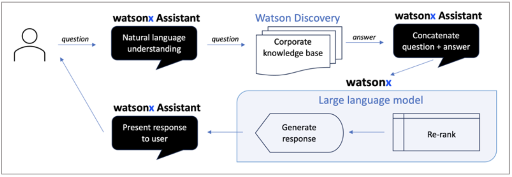
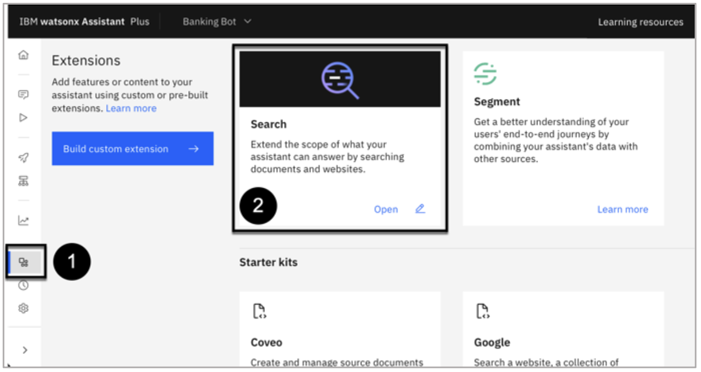
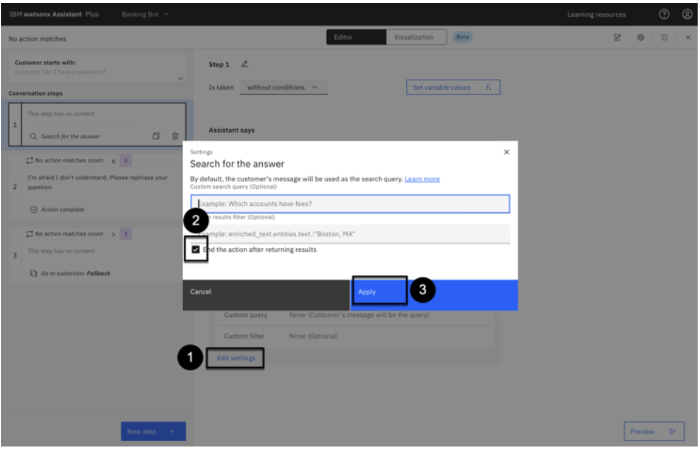

# LLM-powered Conversational Search with watsonx Assistant, watson Discovery and watsonx.ai

**In this lesson**

Learn about IBM watsonx Assistant’s large language model (LLM)-powered Conversational
Search: what it is, how it works, how to set it up, and how to use it.

## What is Conversational Search?

Welcome back to the watsonx Assistant hands-on lab! This section
will focus on Conversational Search, a large language model (LLM)-powered feature that allows
your virtual assistant to answer questions conversationally on a wide range of topics.

#### Business Context

Virtual assistants across every industry, geography, and company of all sizes are almost always
built to answer a wide range of frequently asked questions (FAQs). In watsonx Assistant,
builders have historically built anywhere from dozens to hundreds of Actions to answer FAQs.

FAQs typically require maintenance. Over time, answers change as an organization’s processes,
products, or services evolve. Builders must periodically manually review the Actions they have
built to ensure their answers are accurate and up to date.

Actions that answer FAQs can also be challenging to build because end users can ask questions
in many ways. For example:

- Tell me how to freeze my credit card
- Aren’t I allowed to freeze credit cards?
- How do I freeze my credit card?
- Can you walk me through the process of freezing a credit card

One of these examples is an imperative command: “Tell me.” One of these is a direct
informational question: “How do I...?” One of these is a negative yes-or-no question: “Aren’t
I...?” As a builder, you might struggle to write an answer that addresses all these potential
questions all at once without sounding robotic or unintelligent.

Conversational Search helps builders answer FAQs more easily by using generative AI
(specifically, an LLM) to provide answers. To ensure that generative AI creates accurate,
relevant, and up to date answers to FAQs, Conversational Search first _searches_ for relevant
information in the company’s knowledge base and then _feeds_ that information into the LLM so
that the LLM can generate an answer _grounded_ in the company-specific information.

#### General Benefits

What are the general benefits of Conversational Search? In other words, why would an
organization want to use Conversational Search?

- **Faster build time:** Conversational Search essentially automates the process of answering
    FAQs. Builders no longer need to manually write or build Actions to respond to FAQs,
    saving them dozens of hours of work for the initial build.


- **Less maintenance required:** Conversational Search generates answers grounded in the
    company’s knowledge base. As the company updates its knowledge base, Conversational
    Search generates answers using that updated information. As a result, builders no longer
    need to manually maintain or update Actions to respond to FAQs, saving them hundreds
    of hours of maintenance – the virtual assistant automatically uses the most up-to-date
    information to answer questions!
- **Answers are truly conversational:** Conversational Search is _conversational_. Answers
    generated by Conversational Search are unlikely to sound robotic, stilted, or
    unintelligent; they are generated in real-time as a response to the end user’s unique
    question using an LLM.

These are the _general_ benefits of Conversational Search. Later in this lab, we will discuss the
_differentiators_ and _unique_ benefits of watsonx Assistant’s Conversational Search relative to
architectures and alternatives offered by vendors such as Microsoft and OpenAI.

But first, let’s start with the technical details of Conversational Search.

#### Framework: Retrieval-augmented generation

Conversational Search is a feature in watsonx Assistant that allows Assistant to generate
conversational answers that are grounded in relevant, up-to-date, company-specific information
in response to end users' questions.

Conversational Search uses an AI framework called retrieval-augmented generation (RAG).
RAG is a very popular starting point for enterprises that are just beginning to deploy generative
AI. In 2023 alone, Client Engineering and IBM Consulting engaged in 2000+ proofs of
experience (PoXs) involving RAG.

RAG has two main benefits: It ensures that the LLM generating an answer to a question has
access to the most current, reliable facts relevant to that question, and that users (both end users
and builders) have access to the LLM’s sources, ensuring that its answers can be traced, checked
for accuracy, and ultimately trusted.

Before continuing, and if you are not already familiar with RAG, either 1) watch this well-made
informational video or 2) read this well-written informational article. Both come from IBM
Research and explain RAG.

#### Process

Now that you understand RAG – the framework underpinning Conversational Search – we will
review how Conversational Search specifically implements RAG in IBM watsonx Assistant.

Please note that there are two general ways to implement RAG in watsonx Assistant. First, you
can use Conversational Search, the native, out-of-the-box, no-code feature built in to Assistant.
Second, you can set up custom extensions to set up a custom implementation of RAG with low


code. This lab will primarily focus on Conversational Search, the native, no-code pattern built
into watsonx Assistant.

Conversational Search has three core components: conversational AI, search (retrieval), and a
fine-tuned or prompt-engineered LLM (generation).

Everyone’s heard of ChatGPT, and you can ask it anything – for example, _will I earn miles for a
balance transfer_? It queries its large language model and generates a response:


The answer is generic and demonstrates the shortcomings of the typical LLM. It is
conversational, but not specific to any one enterprise or organization, and there is no way to trace
the answer to its source to verify its accuracy and instill trust in the end user or builder that it is
accurate and reliable.

With Conversational Search, watsonx Assistant searches a knowledge base for information
relevant to a question and uses that relevant information to generate a conversational answer to
the question.

Let’s walk through the order of operations in Conversational Search:

1. First, the end user asks the virtual assistant a question.
    - The virtual assistant uses its natural language understanding (NLU) model to
       determine whether it recognizes the question and whether it can answer it using one
       of its actions for which it has been trained. For example, a bank’s assistant is usually
       trained on answering a question such as, _help me locate the nearest branch_.
    - If the virtual assistant recognizes the question, it answers it using the appropriate
       action (see lab _2. Actions and basic IAM_ ). Conversational Search is not needed. This
       is illustrated in the graphic below.


- However, if the assistant does not recognize the question, it will go to Conversational
    Search. The Conversational Search process is shown and explained in detail below.



2. With Conversational Search, the virtual assistant sends the end user’s question, also known
as a query or request, to a search tool – in this exercise, Watson Discovery. Watson
Discovery has read and processed all relevant corporate documents.
3. The search tool (Watson Discovery) will then search its content and produce search results in
response to the question.
4. The search tool passes these search results back to the virtual assistant in a list.
5. At this point, watsonx Assistant could display the results back to the user. However, they
would not resemble natural speech; they would look more like a set of search results. Helpful
- possibly – but not summarized and presented concisely and conversationally.
6. Therefore, watsonx Assistant sends the question and the list of search results to watsonx,
which invokes an LLM.

```
In some implementations of RAG, an LLM re-ranks the search results. It may reorder or
disregard some of the search results according to how relevant and useful it thinks the search
results are to the question. For example, an LLM might decrease the ranking of a search
result if it is from a document not recently updated, indicating the information may be
outdated. This capability is often called a “neural re-ranker” and is coming soon to watsonx
Assistant’s Conversational Search.
```
7. The LLM generates an answer to the question using the information in the search results, and
    it passes this answer back to watsonx Assistant.


8. The virtual assistant presents this conversational answer to the end user.

```
Answer traceability. In some implementations of RAG, the virtual assistant may show the
end user the search results that the LLM used to generate the answer. This allows the end
user to trace the answer back to its source and confirm its accuracy. This capability is often
called “answer traceability” and is available today in watsonx Assistant’s Conversational
Search.
```
```
Custom passage curation. In some implementations of RAG, the virtual assistant also
shows the end-user snippets of the search results that the LLM used to generate the answer.
These snippets might be direct quotes or 1-2 sentence summaries of the relevant information
in each search result, allowing the end user to understand exactly what the LLM pulled out
from the search result to craft its answer. This capability, often called “custom passage
curation," is available today in watsonx Assistant’s Conversational Search.
```
Conversational Search is much more than document summarization or simple search. It includes
the entire recognition, search, and answer generation process, sometimes also including a neural
re-ranker, answer traceability, and custom passage curation.

The **value-add** of watsonx Assistant in Conversational Search is its ability to orchestrate and
connect every component of RAG using its NLU model, no-code actions, OOTB connectors, and
custom extensions. We will discuss this in more detail in this lab – keep reading for more!

#### Architecture

Here is a generic architecture diagram for conversational search:


And this is another view:


#### LLMs in Conversational Search

Now that we’ve established how Conversational Search uses LLMs, let’s look at the LLM’s used
by watsonx Assistant - the IBM Granite series of models. Up through at least December 2023,
watsonx Assistant has used a prompt-engineered IBM Granite chat v1. In Q1 2024, watsonx
Assistant will start using a prompt-engineered IBM Granite chat v2 for Conversational Search.

Note that although watsonx Assistant’s Conversational Search calls out to the IBM Granite series
of models hosted on watsonx.ai, a client deploying watsonx Assistant does _not_ need to purchase
watsonx.ai to use watsonx Assistant’s Conversational Search. IBM watsonx Assistant
commercially and technically **embeds** watsonx.ai large language models, so customers need only
purchase watsonx Assistant to embed generative AI functionality into their virtual assistants.

Other watsonx LLMs or non-watsonx LLMs can also be fine-tuned or prompt-engineered to
perform RAG or other generative AI use cases. These LLMs can be integrated with watsonx
Assistant via custom extensions. This pattern may be preferable to clients who train their own


LLMs in-house or want customized functionality beyond what is available natively in watsonx
Assistant through Conversational Search.

The **value-add** of watsonx.ai in Conversational Search is its customized large language model,
designed and customized by the watsonx Assistant, IBM Research, and watsonx teams to
perform well for conversational search.

## Native conversational search using IBM Granite


Let’s walk through how to set up watsonx Assistant’s native Conversational Search, which does
not require the use of custom extensions or watsonx.ai. This native Conversational Search
capability is fast and easy to deploy.

**Note**: it is currently only GA on watsonx Assistant SaaS.

From your email notifying you that you have been invited to an IBM Cloud account, click **join now** and follow the instructions.

#### Load a document into Watson Discovery

Next, you will open your Watson Discovery instance.

On IBM Cloud UI, find the watson Discovery service and open it.

On the Watson Discovery launch page, click **Launch Watson Discovery (3)**.

On the welcome page, click **New Project +**.


Enter a **project name (1)** such as “Lendyr documents” and select **Document Retrieval (2)** , then
click **Next (3)**.


Download the Lendyr FAQ document. This is the file you will upload to Watson Discovery.
Once downloaded, click **Upload data (1)** hit **Next (2)**.


Enter a **collection name (1)** such as “Lendyr documents” and click **Next (2)**.


Now, **upload (1)** the FAQ file you downloaded, and click **Next (2)**.


The file uploads relatively quickly, however it may take 15 minutes for Watson Discovery to
process it. To monitor this progress, click **Manage collections (1)** and select the **Lendyr FAQ**
collection tile:


The next screen shows the collection state. Note that your document is still processing **(1)** and
there are **0 Documents available (2)**. The processing will finish when the document becomes
available.


Continue to monitor the processing progress, by clicking **Manage collections (1)** and **Lendyr
FAQ (2)** :


Once the screen says **1 Documents available** , you can proceed to the next step. This processing
usually takes 5 to 15 minutes, so it may be a good time to take a short break.


Now that the processing is finished, let’s ask Watson Discovery the same balance transfer
question we asked ChatGPT at the beginning of this lab section: _will I earn miles for a balance
transfer._ To do this, click on **Improve and Customize (1)** , then type **will I earn miles for a
balance transfer (2)** in the query window. Note the **search result (3)** :


Watson Discovery provides a helpful, though not conversational, answer – an excerpt from a
business document. Yet, it is more useful (“You will not earn miles for balance transfers ...”)
than ChatGPT, because Discovery understands an organization's business content and context.

This lab will apply the power of generative language models to produce a more conversational
and succinct answer to this question.


#### Set up the assistant (brand new instance)

On IBM Cloud UI, find the watsonx Assistant service and open it.

From the instance launch page, click **Launch watsonx Assistant** :

This is a new assistant, so you will first configure the basics. First, enter its **name (1)** ,
**description (2)** , and click **Next (3)** :


Fill out the form asking you how you will use the assistant **(1)** and click **Next (2)** :

**Customize your assistant to look like the Lendyr Bank website**

The next screen allows you to customize the look and feel of the Assistant; customize it to look
like the Lendyr Bank assistant:

1. Change **Assistant's name as known by customers** to “Lendyr Assistant”.
2. Click on **Add an avatar image** and point to https://web-
    chat.global.assistant.watson.appdomain.cloud/assets/Lendyr-Avatar.png.
3. Change **Primary color** to: #004144. This is the color of the chat header.
4. Change **Secondary color** to: #3D3D3D. This colors the message bubble.
5. Change **Accent color** to: #004144. This is a tertiary color that accentuates certain assistant
    responses and icons, as shown below.


Your assistant should now look like the image above. (Note, some color changes may require
that you restart the chat.)

On the following preview screen, you have the option to **change the background (1).** We won’t
do that because we’ll embed the assistant into the Lendyr site, but this is a great option to
customize the look of an assistant so it feels like it is embedded in a client’s website. Click
**Create (2)**.


#### Add the Search extension

Now that you have a Watson Discovery instance setup and an Assistant configured, you can
proceed to add the search extension to your assistant.

In watsonx Assistant, use the left menu to open the **Integrations (1)** page. Then, scroll down and
click the **Search (2)** tile:



Select the **Watson Discovery** search extension:


Next, select the instance of Watson Discovery where you loaded the Lendyr FAQs **(1)** , select the
**Lendyr documents** project **(2)** , and click **Next (3)** :


The following screen is where you map your data schema from Watson Discovery to the title,
body, and URL fields that will be used by watsonx Assistant. (Review the product
documentation here for more information about the options on this screen – you will leave the
default values in this lab.)

First, test the search integration in the Preview window by typing, “Will I earn miles for a
balance transfer?” **(1).** Note that the response is roughly the same answer you got in Watson
Discovery earlier:


You have now successfully integrated Watson Discovery with watsonx Assistant! You will now
take this integration one step further by toggling **Conversational Search** from **Off** to **On (2)**
and clicking **Save (3)**.

#### Add a Search step to an Action

As you’ve experienced in this lab series, watsonx Assistant is powerful and versatile in its ability
to _tell, show_ and _do._ Often, Conversational Search will not be the first option for end users – for
example, users who want to perform a transaction will likely be guided through a process
managed through one or more Actions.

In this lab, you will set up Conversational Search to invoke when the assistant cannot match the
end-user question to one of the Actions. The simplest way to do this is to add a Step to an Action
provided automatically with each Assistant instance: the _No action matches_ action.

To do this, go to the **Actions (1)** window, click on the actions which are **Set by assistant (2)** , and
select the **No action matches (3)** action:


Then, as shown below,

1. Click **New step +**
2. Make sure this new step is the first in the sequence (you can drag and drop it in the list)
3. Under **And then** select **Search for the answer**


Next, click **Edit settings (1),** and in the ensuing popup, select **End the action after returning
results (2)** , and click **Apply (3)** :



Save the action.

#### Try it out!

Now that you are finished configuring your assistant, try it out! Click on **Preview** and enter these
questions. None of the actions have been trained to answer these questions:

- Will I earn miles for a balance transfer?
- What is Lendyr Bank’s routing number for electronic transactions?
- How can I get the 20% discount with the Lendyr AirMiles credit card?
- Can I order checks for my Checking account?
- Does FDIC insurance cover my brokerage account? *
- Where can I learn more about what FDIC covers? *

* There are no answers to these questions in the FAQs you uploaded to Watson Discovery; the
response is provided by the IBM Granite Large Language Model.


Note the clear, concise, and conversational answers. Compare this to the generic answers from
ChatGPT and the excerpt answer from Watson Discovery earlier!

## Continue your learning

You have now completed this section of the lab, which also concludes this lab.
